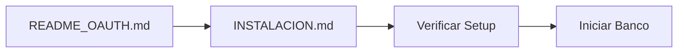
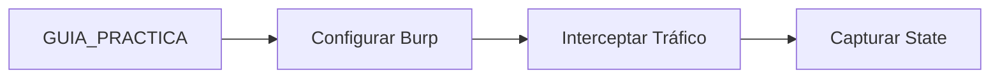
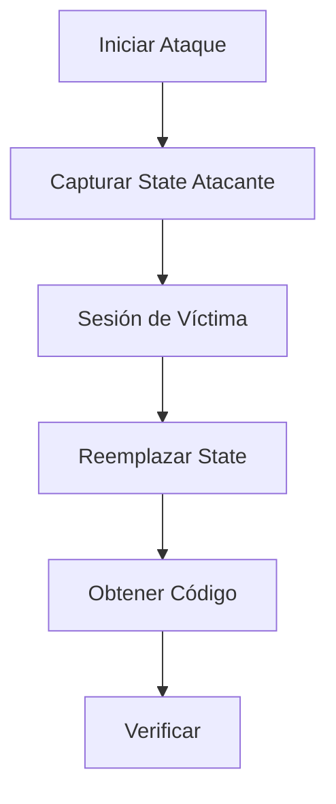

# 📚 ÍNDICE COMPLETO - DOCUMENTACIÓN OAUTH2

## 🎯 Documentos Principales

### Para Estudiantes

| Documento | Descripción | Uso |
|-----------|-------------|-----|
| **[README_OAUTH.md](README_OAUTH.md)** | Inicio rápido del desafío | ⭐ Leer primero |
| **[INSTALACION.md](INSTALACION.md)** | Instalación de dependencias | ⚙️ Setup inicial |
| **[GUIA_PRACTICA_OAUTH.md](GUIA_PRACTICA_OAUTH.md)** | Tutorial paso a paso completo | 📖 Guía principal |
| **[DESAFIO_OAUTH.md](DESAFIO_OAUTH.md)** | Referencia técnica del ataque | 🎯 Durante el desafío |
| **[GUIA_COMPLETA_OAUTH](GUIA_COMPLETA_OAUTH)** | Todas las vulnerabilidades OAuth | 📚 Referencia completa |

### Para Instructores

| Documento | Descripción | Uso |
|-----------|-------------|-----|
| **[RESUMEN_MODIFICACIONES.md](RESUMEN_MODIFICACIONES.md)** | Cambios realizados al proyecto | 📋 Overview del proyecto |
| **[OAUTH_VULNERABILITIES.md](OAUTH_VULNERABILITIES.md)** | Catálogo técnico de vulnerabilidades | 🔍 Análisis profundo |

---

## 📂 Estructura de Archivos

```
TPI-SDS/
├── app_banco.py                    # Aplicación principal del banco
├── app_enunciados.py               # Servidor de desafíos
├── requirements.txt                # Dependencias Python
│
├── docs/
│   ├── INDICE_OAUTH.md            # 📍 Este archivo
│   ├── README_OAUTH.md            # Inicio rápido
│   ├── INSTALACION.md             # Setup de herramientas
│   ├── GUIA_PRACTICA_OAUTH.md     # Tutorial paso a paso
│   ├── DESAFIO_OAUTH.md           # Referencia del ataque
│   ├── GUIA_COMPLETA_OAUTH        # Documentación original
│   ├── OAUTH_VULNERABILITIES.md   # Catálogo de vulnerabilidades
│   ├── RESUMEN_MODIFICACIONES.md  # Log de cambios
│   └── DESAFIO_EXPLORACION.md     # Desafío RCE (otro)
│
├── templates/
│   ├── desafio_oauth.html         # Interfaz web del desafío
│   ├── desafio_oauth_avanzado.html
│   ├── oauth_info.html            # Vulnerabilidad #2
│   ├── oauth_fakegoogle_login.html
│   └── oauth_fakegoogle_authorize.html
│
└── tools/
    ├── test_oauth_vulnerabilities.py  # Script de testing
    └── solucion_rce.py                # Solución desafío RCE
```

---

## 🚀 Flujo de Uso Recomendado

### Fase 1: Preparación (30 minutos)



1. **Leer** → [README_OAUTH.md](README_OAUTH.md)
   - Entender el objetivo
   - Revisar credenciales
   - Ver requisitos

2. **Instalar** → [INSTALACION.md](INSTALACION.md)
   - Python y dependencias
   - Burp Suite
   - Configurar navegador

3. **Verificar**
   ```bash
   python app_banco.py
   # Verificar: http://127.0.0.1:5000
   ```

### Fase 2: Aprendizaje (60 minutos)



1. **Estudiar** → [GUIA_PRACTICA_OAUTH.md](GUIA_PRACTICA_OAUTH.md)
   - Leer las 9 secciones
   - Ver ejemplos de código
   - Entender el flujo OAuth

2. **Practicar**
   - Configurar Burp Suite
   - Interceptar peticiones
   - Familiarizarse con Forward/Drop

### Fase 3: Explotación (90 minutos)



1. **Ejecutar** → [DESAFIO_OAUTH.md](DESAFIO_OAUTH.md)
   - Seguir fase por fase
   - Tomar screenshots
   - Documentar hallazgos

2. **Verificar**
   ```
   http://127.0.0.1:5001/desafio/oauth
   Ingresar código obtenido
   ```

### Fase 4: Profundización (Opcional)

1. **Explorar** → [GUIA_COMPLETA_OAUTH](GUIA_COMPLETA_OAUTH)
   - Vulnerabilidad #2: Secret Expuesto
   - Vulnerabilidad #3: Code Reuse
   - Vulnerabilidad #4: Redirect URI
   - Vulnerabilidad #5: Info Disclosure

2. **Automatizar** → `tools/test_oauth_vulnerabilities.py`
   ```bash
   cd tools
   python test_oauth_vulnerabilities.py
   ```

---

## 📖 Guía de Lectura por Nivel

### Nivel Principiante

**Si nunca has usado Burp Suite:**
1. ⭐ [README_OAUTH.md](README_OAUTH.md) - Contexto general
2. ⚙️ [INSTALACION.md](INSTALACION.md) - Setup completo
3. 📖 [GUIA_PRACTICA_OAUTH.md](GUIA_PRACTICA_OAUTH.md) - Tutorial paso a paso
   - Especialmente: Sección 2 (Configuración)
   - Especialmente: Sección 3 (Captura del State)

**Tiempo estimado:** 3-4 horas

### Nivel Intermedio

**Si ya conoces Burp Suite:**
1. ⭐ [README_OAUTH.md](README_OAUTH.md) - Overview rápido
2. 🎯 [DESAFIO_OAUTH.md](DESAFIO_OAUTH.md) - Referencia directa
3. 📖 [GUIA_PRACTICA_OAUTH.md](GUIA_PRACTICA_OAUTH.md) - Consultar secciones específicas

**Tiempo estimado:** 2-3 horas

### Nivel Avanzado

**Si tienes experiencia en pentesting:**
1. 🎯 [DESAFIO_OAUTH.md](DESAFIO_OAUTH.md) - Flujo técnico
2. 📚 [GUIA_COMPLETA_OAUTH](GUIA_COMPLETA_OAUTH) - Todas las vulnerabilidades
3. 🔍 [OAUTH_VULNERABILITIES.md](OAUTH_VULNERABILITIES.md) - Análisis profundo
4. 🤖 `test_oauth_vulnerabilities.py` - Automatización

**Tiempo estimado:** 1-2 horas

---

## 🎓 Contenido por Documento

### 📄 README_OAUTH.md

**Qué incluye:**
- ✅ Inicio rápido (5 minutos)
- ✅ Estructura de archivos
- ✅ Credenciales de prueba
- ✅ FAQ común
- ✅ Comandos de inicio

**Cuándo usar:** Primer documento a leer, referencia rápida

---

### 📄 INSTALACION.md

**Qué incluye:**
- ✅ Instalación de Python y dependencias
- ✅ Instalación de Burp Suite (Win/Mac/Linux)
- ✅ Configuración de navegador
- ✅ Certificado CA de Burp
- ✅ Verificación de setup
- ✅ Troubleshooting

**Cuándo usar:** Antes de comenzar el desafío

---

### 📄 GUIA_PRACTICA_OAUTH.md (Principal)

**Qué incluye:**
- ✅ **Sección 1:** Introducción al desafío
- ✅ **Sección 2:** Configuración completa
- ✅ **Sección 3:** Reconocimiento
- ✅ **Sección 4:** Captura del State (CRÍTICO)
- ✅ **Sección 5:** Ataque CSRF paso a paso
- ✅ **Sección 6:** Verificación
- ✅ **Sección 7:** Análisis técnico
- ✅ **Sección 8:** Otras vulnerabilidades
- ✅ **Sección 9:** Mitigaciones

**Extensión:** ~8,000 palabras  
**Tiempo de lectura:** 30-40 minutos  
**Tiempo de ejecución:** 90-120 minutos  

**Cuándo usar:** Guía principal durante todo el desafío

---

### 📄 DESAFIO_OAUTH.md

**Qué incluye:**
- ✅ Contexto de la vulnerabilidad
- ✅ Impacto y severidad
- ✅ Preparación del entorno
- ✅ 3 fases del ataque detalladas
- ✅ Análisis del tráfico HTTP real
- ✅ Código vulnerable vs seguro
- ✅ Evidencias y verificación

**Extensión:** ~6,000 palabras  
**Cuándo usar:** Referencia técnica durante la explotación

---

### 📄 GUIA_COMPLETA_OAUTH (Original)

**Qué incluye:**
- ✅ Las 5 vulnerabilidades OAuth
- ✅ Explotación paso a paso de cada una
- ✅ Mitigaciones detalladas
- ✅ Referencias RFC
- ✅ CVEs relacionados

**Cuándo usar:** Para explorar vulnerabilidades adicionales

---

### 📄 OAUTH_VULNERABILITIES.md

**Qué incluye:**
- ✅ Catálogo técnico de vulnerabilidades
- ✅ CWE y CVSS scores
- ✅ Ubicación en código
- ✅ PoC de cada vulnerabilidad

**Cuándo usar:** Referencia técnica avanzada

---

### 📄 RESUMEN_MODIFICACIONES.md

**Qué incluye:**
- ✅ Archivos creados y modificados
- ✅ Características implementadas
- ✅ Checklist de completitud
- ✅ Roadmap para estudiantes

**Cuándo usar:** Para instructores y desarrolladores

---

## 🔍 Búsqueda Rápida

### ¿Buscas información sobre...?

| Tema | Documento | Sección |
|------|-----------|---------|
| **Instalación de Burp Suite** | INSTALACION.md | Burp Suite Community |
| **Configuración del proxy** | GUIA_PRACTICA_OAUTH.md | Sección 2 - Configuración |
| **Captura del state** | GUIA_PRACTICA_OAUTH.md | Sección 4 - Captura del State |
| **Reemplazar state de María** | DESAFIO_OAUTH.md | Fase 3 - Ataque CSRF |
| **Código vulnerable** | GUIA_PRACTICA_OAUTH.md | Sección 7 - Análisis Técnico |
| **Mitigaciones** | GUIA_COMPLETA_OAUTH | Vulnerabilidad 1 |
| **Otras vulnerabilidades** | GUIA_COMPLETA_OAUTH | Vulnerabilidades 2-5 |
| **Script automatizado** | README_OAUTH.md | Opción 2 |
| **Troubleshooting** | INSTALACION.md | Troubleshooting |
| **Credenciales** | README_OAUTH.md | Credenciales de Prueba |

---

## 📊 Matriz de Contenido

| Documento | Principiante | Intermedio | Avanzado | Setup | Teoría | Práctica |
|-----------|--------------|------------|----------|-------|--------|----------|
| README_OAUTH | ✅✅✅ | ✅✅ | ✅ | ✅✅ | ✅ | ✅ |
| INSTALACION | ✅✅✅ | ✅ | - | ✅✅✅ | - | ✅✅ |
| GUIA_PRACTICA | ✅✅✅ | ✅✅✅ | ✅✅ | ✅✅ | ✅✅✅ | ✅✅✅ |
| DESAFIO_OAUTH | ✅✅ | ✅✅✅ | ✅✅✅ | ✅ | ✅✅ | ✅✅✅ |
| GUIA_COMPLETA | ✅ | ✅✅ | ✅✅✅ | - | ✅✅✅ | ✅✅ |
| OAUTH_VULNERABILITIES | - | ✅ | ✅✅✅ | - | ✅✅✅ | ✅ |

**Leyenda:**
- ✅✅✅ = Muy recomendado
- ✅✅ = Recomendado
- ✅ = Opcional
- \- = No aplica

---

## 🎯 Rutas de Aprendizaje

### Ruta 1: "Solo quiero completar el desafío"

```
1. README_OAUTH.md (15 min)
2. INSTALACION.md - Solo sección "Burp Suite" (30 min)
3. DESAFIO_OAUTH.md - Fases 1-4 (120 min)
4. Verificar en interfaz web (5 min)

Total: ~3 horas
```

### Ruta 2: "Quiero aprender en profundidad"

```
1. README_OAUTH.md (15 min)
2. INSTALACION.md - Completo (45 min)
3. GUIA_PRACTICA_OAUTH.md - Todas las secciones (60 min)
4. Ejecutar desafío con DESAFIO_OAUTH.md (120 min)
5. GUIA_COMPLETA_OAUTH - Vulnerabilidades 2-5 (90 min)
6. test_oauth_vulnerabilities.py (30 min)

Total: ~6 horas
```

### Ruta 3: "Soy instructor, necesito entender todo"

```
1. RESUMEN_MODIFICACIONES.md (20 min)
2. README_OAUTH.md (10 min)
3. GUIA_PRACTICA_OAUTH.md (45 min)
4. DESAFIO_OAUTH.md (30 min)
5. GUIA_COMPLETA_OAUTH (60 min)
6. OAUTH_VULNERABILITIES.md (30 min)
7. Revisar código: app_banco.py (45 min)
8. test_oauth_vulnerabilities.py (15 min)

Total: ~4 horas
```

---

## 📞 ¿Dónde Buscar Ayuda?

| Problema | Documento | Sección |
|----------|-----------|---------|
| No puedo instalar Burp | INSTALACION.md | Burp Suite Community |
| Burp no intercepta | INSTALACION.md | Troubleshooting |
| No entiendo OAuth | GUIA_PRACTICA_OAUTH.md | Sección 1 - Introducción |
| No sé qué es el state | DESAFIO_OAUTH.md | Contexto de la Vulnerabilidad |
| Error al capturar state | GUIA_PRACTICA_OAUTH.md | Sección 4 |
| Código no es aceptado | README_OAUTH.md | FAQ |
| Servidor no inicia | INSTALACION.md | Troubleshooting |
| Quiero ver código | GUIA_PRACTICA_OAUTH.md | Sección 7 |

---

## ✅ Checklist de Documentos Leídos

Marca los documentos que has leído:

**Esenciales:**
- [ ] README_OAUTH.md
- [ ] INSTALACION.md
- [ ] GUIA_PRACTICA_OAUTH.md
- [ ] DESAFIO_OAUTH.md

**Opcionales:**
- [ ] GUIA_COMPLETA_OAUTH
- [ ] OAUTH_VULNERABILITIES.md
- [ ] RESUMEN_MODIFICACIONES.md

**Script:**
- [ ] He ejecutado test_oauth_vulnerabilities.py

---

## 🎉 Logros Desbloqueables

- 🥉 **Bronce:** Completar el desafío CSRF principal
- 🥈 **Plata:** Explotar 3+ vulnerabilidades OAuth
- 🥇 **Oro:** Completar todas las 5 vulnerabilidades
- 💎 **Diamante:** Ejecutar el script automatizado exitosamente
- 🏆 **Máster:** Escribir informe completo con mitigaciones

---

**📌 TIP:** Guarda este índice como referencia rápida durante el desafío.

**Última actualización:** Noviembre 2025  
**Versión:** 1.0
